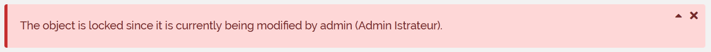

Alert
=====

Alerts are the main component to give feedback to the user or communicate page specific to system wide messages.

Alerts are a rectangular component displaying a title and a message.

----

Output Result
-------------

:Success Alert:

.. image:: AlertSuccess.png

:Failure Alert:

:Information Alert:

.. image:: AlertInformation.png

:Warning Alert:

.. image:: AlertWarning.png

----

Twig Tag
--------

:Tag: **UIAlert**

:Syntax:

::

    
        Content Goes Here
    

:Type:

+------------------------------+-----------------------------------------------------+
| *ForSuccess*                 | Create a *Success Alert*                            |
+------------------------------+-----------------------------------------------------+
| *ForInformation*             | Create an *Information Alert*                       |
+------------------------------+-----------------------------------------------------+
| *ForWarning*                 | Create an *Warning Alert*                           |
+------------------------------+-----------------------------------------------------+
| *ForFailure*                 | Create an *Failure Alert*                           |
+------------------------------+-----------------------------------------------------+
| *ForDanger*                  | Create an *Danger Alert*                            |
+------------------------------+-----------------------------------------------------+
| *Neutral*                    | Create an *Basis Alert*                             |
+------------------------------+-----------------------------------------------------+
| *WithBrandingPrimaryColor*   | Create an alert having the branding primary color   |
+------------------------------+-----------------------------------------------------+
| *WithBrandingSecondaryColor* | Create an alert having the branding secondary color |
+------------------------------+-----------------------------------------------------+

:Alert common parameters:

+-------------------+--------+----------+----------------------------------+
| *sTiTle*          | string | optional | Title of the alert               |
+-------------------+--------+----------+----------------------------------+
| *sContent*        | string | optional | Collapsible content of the alert |
+-------------------+--------+----------+----------------------------------+
| *sId*             | string | optional | ID of the HTML block             |
+-------------------+--------+----------+----------------------------------+
| *IsCollapsible*   | bool   | optional | can be collapsed or not          |
+-------------------+--------+----------+----------------------------------+
| *IsClosable*      | bool   | optional | can be closed or not             |
+-------------------+--------+----------+----------------------------------+
| *OpenedByDefault* | bool   | optional | Opened or not                    |
+-------------------+--------+----------+----------------------------------+

:See also: :ref:`UIBlock Common parameters <UIBlock_parameters>`

----

Examples
--------

Example to generate an temporary information with a spinner (on the real display the spinner is animated)::

    
        
            {{ 'iTopUpdate:UI:CanCoreUpdate:Loading'|dict_s }}
            
        
    

The information displayed:

.. image:: AlertInformationExample.png

The javascript to set a success or a failure in return of an ajax call::

    function (data) {
        var oRequirements = $("#header-requirements");
        var oCanCoreUpdate = $("#can-core-update");
        oCanCoreUpdate.html(data.sMessage);
        oRequirements.removeClass("ibo-is-information");
        if (data.bStatus) {
            oRequirements.addClass("ibo-is-success");
        } else {
            oRequirements.addClass("ibo-is-failure");
        }
    }

----

Example to generate a hidden alert to display using javascript in case of error::

    
        *The content goes here*
    

The javascript to show the alert::

    $("#dir_error_outer").removeClass("ibo-is-hidden");

The error displayed:

.. image:: AlertFailureExample.png