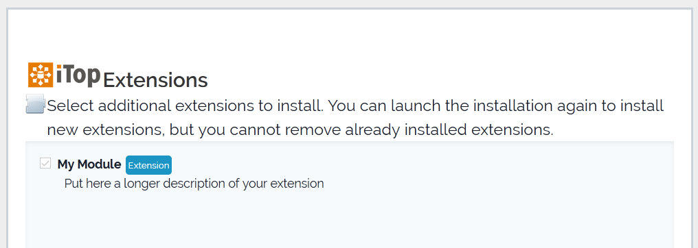

.. Copyright (C) 2010-2021 Combodo SARL
.. http://opensource.org/licenses/AGPL-3.0

.. _Step2:

2. Hello World!
===============

The controller
--------------

Create a controller into ``my-module/src/Controller``, let's call it ``MyModuleController`` extending  ``Combodo\iTop\Application\TwigBase\Controller\Controller``

.. code-block:: php
    :linenos:

    <?php

    namespace MyCompany\iTop\MyModule\Controller;
    use Combodo\iTop\Application\TwigBase\Controller\Controller;

    class MyModuleController extends Controller
    {
    }

Let's add a *Hello World* operation

.. code-block:: php
    :linenos:

    <?php

    class MyModuleController extends Controller
    {
        public function OperationHelloWorld()
        {
            $this->DisplayPage();
        }
    }

This will just display the Twig template corresponding to this operation.
Here the operation is **HelloWorld** without space.
The name of the method is built from the operation name by adding *Operation* at the beginning: ``OperationHelloWorld``.

Calling the method ``DisplayPage()`` will render the template named after the operation: ``HelloWorld.html.twig`` it will be located in the folder ``my-module/templates``.

The template
------------

Let's create the template ``my-module/templates/HelloWorld.html.twig`` with a nice title.

.. code-block:: twig
    :linenos:

    

Twig syntax can be found `Here <https://twig.symfony.com/doc/3.x/>`_.

For more information on specific iTop Twig tags you can check :ref:`Components` and :ref:`Layouts`

The end point
-------------

Then create landing page for your module ``my-module/index.php``

.. code-block:: php
    :linenos:

    <?php

    namespace MyCompany\iTop\SystemInformation;

    use MyCompany\iTop\MyModule\Controller\MyModuleController;

    require_once(APPROOT.'application/startup.inc.php');

    $oUpdateController = new MyModuleController(MODULESROOT.'my-module/templates', 'my-module');
    $oUpdateController->SetDefaultOperation('HelloWorld');
    $oUpdateController->HandleOperation();

Create an instance of the controller indicating the templates path and the module name.
The default operation is set to the operation we want when entering the module.
The method ``HandleOperation()`` will call the method corresponding to the specified operation.

Now you have to build the autoloader by running ``composer dump-autoload`` into the module folder ``my-module``.

The next operation is the `setup <https://www.itophub.io/wiki/page?id=latest%3Ainstall%3Ainstall_wizard>`_. You will be able to select your module.

For more comfort during the development of your module, you can `install the toolkit <https://www.itophub.io/wiki/page?id=latest%3Acustomization%3Adatamodel#installing_the_toolkit>`_ and update your iTop with symlinks.

if you go to your module page ``https://localhost/itop/pages/exec.php?exec_module=my-module&exec_page=index.php`` you should see:

.. image:: Step2.png