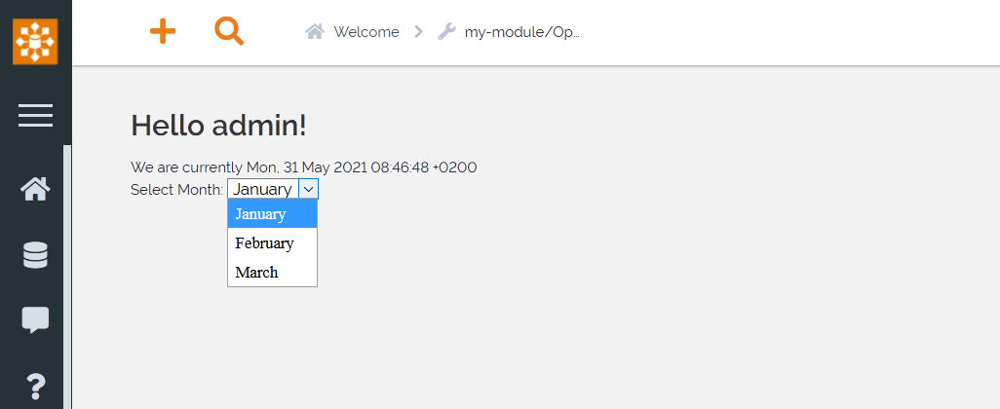

.. Copyright (C) 2010-2021 Combodo SARL
.. http://opensource.org/licenses/AGPL-3.0

.. _Step3:

3. Passing variables to templates
=================================

We have seen in :ref:`Step2` how to create a static template. Let's send some variables to have a more dynamic display.

.. code-block:: php
    :linenos:
    :caption: src/Controller/MyModuleController.php

    <?php

    namespace MyCompany\iTop\MyModule\Controller;
    use Combodo\iTop\Application\TwigBase\Controller\Controller;
    use UserRights;

    class MyModuleController extends Controller
    {
        public function OperationHelloWorld()
        {
            $aParams['sName'] = UserRights::GetUser();
            $aParams['sDate'] = date("r");
            $this->DisplayPage($aParams);
        }
    }

The ``DisplayPage()`` method accept an array of parameters. This array is transformed into variables for the Twig template.

Here two variables are created: ``sName`` and ``sDate``, we can use them in the template.

.. code-block:: twig
    :linenos:
    :caption: templates/HelloWorld.html.twig

    
    
        We are currently {{ sDate }}
    

The output is then

.. image:: Hello2.png

The variables can be of any type, for example you can give an array as a variable:

.. code-block:: php
    :linenos:
    :caption: src/Controller/MyModuleController.php

    <?php

    namespace MyCompany\iTop\MyModule\Controller;
    use Combodo\iTop\Application\TwigBase\Controller\Controller;
    use UserRights;

    class MyModuleController extends Controller
    {
        public function OperationHelloWorld()
        {
            $aParams['sName'] = UserRights::GetUser();
            $aParams['sDate'] = date("r");
            $aParams['aQuarter'] = ['January', 'February', 'March'];
            $this->DisplayPage($aParams);
        }
    }

Here ``aQuarter`` is an array containing some months, we can use it in a selector:

.. code-block:: twig
    :linenos:
    :caption: templates/HelloWorld.html.twig

    
    
        We are currently {{ sDate }}
    

    
        Select Month:
        
            
                
            
        
    

The output is:

