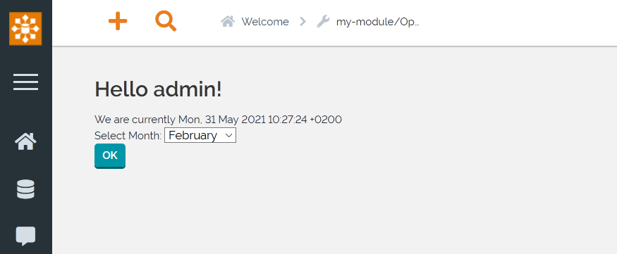

.. Copyright (C) 2010-2021 Combodo SARL
.. http://opensource.org/licenses/AGPL-3.0

.. _Step4:

4. Adding new operations
========================

We currently have only one operation ``HelloWorld``. Generally multiple operations are needed, let's add a new one.

In the previous part :ref:`Step3` we have created a form, it will be used to call the operation ``SelectMonth``.

Modify the form to add an hidden input to set the operation and add a submit button:

.. code-block:: twig
    :lineno-start: 6
    :caption: templates/HelloWorld.html.twig

    
        Select Month:
        
            
                
            
        
        
        
            
        
    

The output of this template is:

Now add the operation in the controller:

.. code-block:: php
    :linenos:
    :caption: src/Controller/MyModuleController.php

    <?php

    // ...

    class MyModuleController extends Controller
    {
        // ...

        public function OperationSelectMonth()
        {
            $aMonths = ['January', 'February', 'March'];
            $iMonth = utils::ReadParam('month', 0);
            $aParams['sSelectedMonth'] = $aMonths[$iMonth];
            $this->DisplayPage($aParams);
        }
    }

*Disclaimer: The code is for tutorial only, don't use it in production as no check is done on the entries*

The corresponding template must be created ``templates/SelectMonth.html.twig``

.. code-block:: twig
    :linenos:
    :caption: templates/SelectMonth.html.twig

    

    
        The selected month is {{ sSelectedMonth }}
    

The output of this operation is:

.. image:: SelectMonth.png

