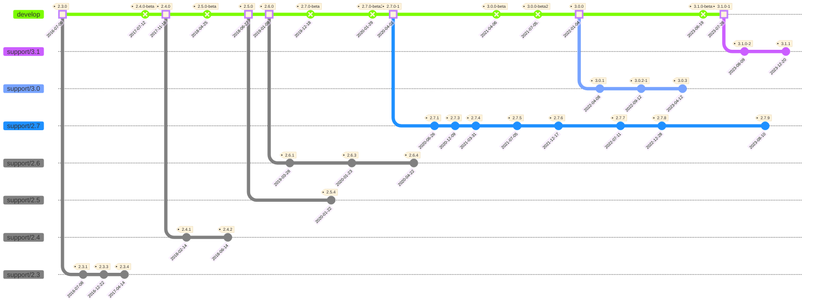

# iTop version history

```mermaid
%%{init: { 'logLevel': 'debug', 'theme': 'base', 'themeVariables': {
              'git0': 'lawngreen',
              'git3': 'dodgerblue',
              'git4': 'grey',
              'git5': 'grey',
              'git6': 'grey',
              'git7': 'grey'
       }, 'gitGraph': {'showBranches': true,'mainBranchName': 'develop','rotateCommitLabel': true}} }%%
gitGraph
    commit id: "2016-07-06" tag: "2.3.0" type: HIGHLIGHT
    branch support/2.3 order: 900
    commit id: "2016-07-08" tag: "2.3.1"
    commit id: "2016-12-22" tag: "2.3.3"
    commit id: "2017-04-14" tag: "2.3.4"
    checkout develop
    commit id: "2017-07-12" tag: "2.4.0-beta" type: REVERSE
    commit id: "2017-11-16" tag: "2.4.0" type: HIGHLIGHT
    branch support/2.4 order: 890
    commit id: "2018-02-14" tag: "2.4.1"
    checkout develop
    commit id: "2018-04-25" tag: "2.5.0-beta" type: REVERSE
    checkout support/2.4
    commit id: "2018-06-14" tag: "2.4.2"
    checkout develop
    commit id: "2018-06-27" tag: "2.5.0" type: HIGHLIGHT
    branch support/2.5 order: 880
    checkout develop
    commit id: "2019-01-09" tag: "2.6.0" type: HIGHLIGHT
    branch support/2.6 order: 870
    commit id: "2019-03-28" tag: "2.6.1"
    checkout develop
    commit id: "2019-12-18" tag: "2.7.0-beta" type: REVERSE
    checkout support/2.5
    commit id: "2020-01-22" tag: "2.5.4"
    checkout support/2.6
    commit id: "2020-01-23" tag: "2.6.3"
    checkout develop
    commit id: "2020-01-29" tag: "2.7.0-beta2" type: REVERSE
    commit id: "2020-04-01" tag: "2.7.0-1" type: HIGHLIGHT
    checkout support/2.6
    commit id: "2020-04-22" tag: "2.6.4"
    checkout develop
    branch support/2.7 order: 860
    commit id: "2020-06-26" tag: "2.7.1"
    checkout support/2.7
    commit id: "2020-12-09" tag: "2.7.3"
    commit id: "2021-03-31" tag: "2.7.4"
    checkout develop
    commit id: "2021-04-06" tag: "3.0.0-beta" type: REVERSE
    checkout support/2.7
    commit id: "2021-07-05" tag: "2.7.5"
    checkout develop
    commit id: "2021-07-05." tag: "3.0.0-beta2" type: REVERSE
    checkout support/2.7
    commit id: "2021-12-17" tag: "2.7.6"
    checkout develop
    commit id: "2022-01-04" tag: "3.0.0" type: HIGHLIGHT
    branch support/3.0 order: 850
    commit id: "2022-04-08" tag: "3.0.1"
    checkout support/2.7
    commit id: "2022-07-11" tag: "2.7.7"
    checkout support/3.0
    commit id: "2022-09-12" tag: "3.0.2-1"
    checkout develop
    checkout support/2.7
    commit id: "2022-12-28" tag: "2.7.8"
    checkout support/3.0
    commit id: "2023-04-12" tag: "3.0.3"
    checkout develop
    commit id: "2023-06-19" tag: "3.1.0-beta" type: REVERSE
    commit id: "2023-07-26" tag: "3.1.0-1" type: HIGHLIGHT
    branch support/3.1 order: 840
    checkout support/3.1
    commit id: "2023-08-09" tag: "3.1.0-2"
    checkout support/2.7
    commit id: "2023-08-10" tag: "2.7.9"
    checkout support/3.1
    commit id: "2023-12-20" tag: "3.1.1"
```

To learn more, check the [iTop community versions history on the official wiki](https://www.itophub.io/wiki/page?id=latest:release:start).
